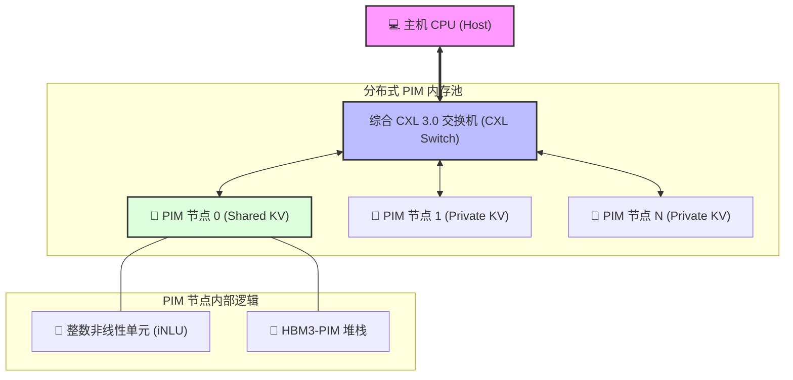
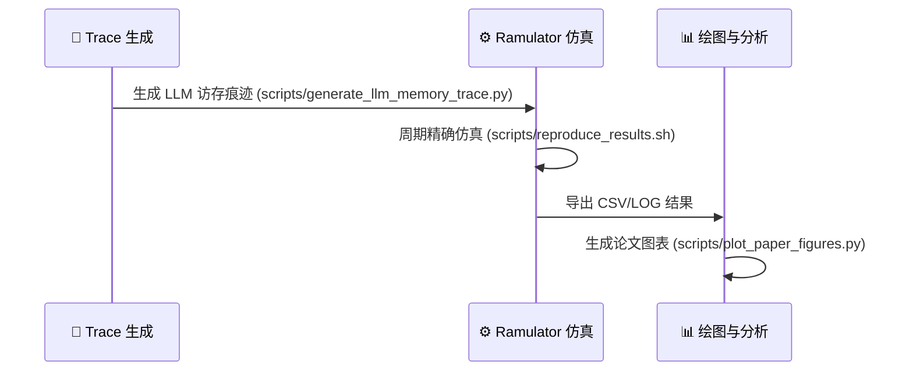

# LKC-CXL-PIM & DisaggKV: 超长上下文 LLM 加速架构 🚀

[](https://www.python.org/)
[](https://isocpp.org/)
[](https://www.computeexpresslink.org/)
[](https://www.samsung.com/semiconductor/dram/hbm3-pim/)

> "打破 HBM 容量墙，通过 CXL 与内质网计算（PIM）实现百万级上下文大模型的无损加速。"

本项目包含硬件-软件协同设计的架构实现与仿真标准环境，支撑以下两篇核心研究论文：

1.  **LKC-CXL-PIM**: 专注于近内存 Attention 加速（iNLU），通过整数化 PIM 技术克服单机 HBM 容量限制。
2.  **DisaggKV**: 专注于可扩展的 CXL 内存池化，利用 P2P 织物同步实现多租户服务的高效 KV 缓存管理。

---

## 🏗️ 系统架构 (Architecture)

本项目模拟了一个高性能的 **CXL 3.0 分布式内存池**，多个 PIM 节点通过 CXL Switch 互联。



---

## 🧠 核心模块深度解析

### 1. iNLU: 整数非线性单元 (Integer Non-Linear Unit)
为了在内存芯片内部（PIM）实现低功耗的 Attention 计算，我们设计了 **iNLU**。它能够以全整数（Integer-only）方式高精度逼近 Softmax 和 LayerNorm。
- **算法原理**: 使用 I-BERT 风格的多项式逼近，结合范围缩减技术（Range Reduction）：
  $e^x = 2^n \cdot e^f$，其中 $f \in [-\ln 2, 0]$。
- **硬件实现**: 仅需移位器（Shifter）和乘加器（MAC），无需昂贵的浮点运算单元。
- **代码参考**: [`scripts/iNLU_algorithm_sim.py`](file:///Users/lkc/Downloads/lkcproject/LKC-CXL-PIM/scripts/iNLU_algorithm_sim.py)

### 2. DisaggKV: 存算分离 KV 缓存池
解决分布式大模型推理中的“地址对齐”与“数据同步”难题。
- **池化机制**: 通过 CXL 3.0 的 P2P 路由实现节点间 KV 数据的高速交换。
- **容错模拟**: 支持节点故障后的快速状态恢复模拟。
- **代码参考**: [`scripts/cxl_fabric_simulator.py`](file:///Users/lkc/Downloads/lkcproject/LKC-CXL-PIM/scripts/cxl_fabric_simulator.py)

---

## 🛠️ 环境配置与安装 (Frictionless Quickstart)

### 1. 基础环境
确保已安装 [Conda](https://docs.conda.io/) 和 [Docker](https://www.docker.com/)。

```bash
# 创建并激活 conda 环境
conda env create -f environment.yml
conda activate lkcpim

# 编译项目核心仿真器 (Ramulator 2)
cd ramulator2
mkdir build && cd build
cmake ..
make -j$(nproc)
```

### 2. 实验复现流水线



---

## 🚀 运行复现脚本

### 任务 1: 复现 LKC-CXL-PIM (单节点评测)
运行周期精确的 Ramulator 2.0 仿真，支持 2K 到 128K 的上下文长度。
```bash
# 生成 HBM3PIM 访存痕迹
python3 scripts/generate_llm_memory_trace.py

# 启动全量基准测试与对比
bash scripts/reproduce_results.sh
```

### 任务 2: 复现 DisaggKV (多节点评测)
模拟具有 1-16 个分布式存储节点的 CXL 3.0 织物结构。
```bash
# 计算可扩展性数据点
python3 scripts/recompute_scalability_data.py

# 绘制出版级图表 (PDF/PNG)
python3 scripts/plot_paper_figures.py
```

---

## 📂 项目结构指南

| 目录/文件 | 说明 |
| :--- | :--- |
| [`ramulator2/`](file:///Users/lkc/Downloads/lkcproject/LKC-CXL-PIM/ramulator2/) | 深度定制的仿真内核，支持 HBM3PIM 与 CXL 协议 |
| [`scripts/`](file:///Users/lkc/Downloads/lkcproject/LKC-CXL-PIM/scripts/) | 包含 iNLU 算法、CXL 织物模拟器及所有复现脚本 |
| [`paper_assets/`](file:///Users/lkc/Downloads/lkcproject/LKC-CXL-PIM/paper_assets/figures/) | 存储自动生成的论文图表与综合报告 |
| [`pimmain.tex`](file:///Users/lkc/Downloads/lkcproject/LKC-CXL-PIM/pimmain.tex) | 论文手稿 1: *Long KV Cache via CXL Processing-in-Memory* |
| [`cxlmain.tex`](file:///Users/lkc/Downloads/lkcproject/LKC-CXL-PIM/cxlmain.tex) | 论文手稿 2: *Scalable and Disaggregated CXL-PIM Pooling* |

---

## 📄 联系信息
**Kaichen Li** (lkcfqy@gmail.com)

> [!TIP]
> 如果您在仿真过程中遇到 Docker 权限问题，请确保您的用户已加入 `docker` 组。

---
Generated with ❤️ by **Antigravity Project Audit SOP**
