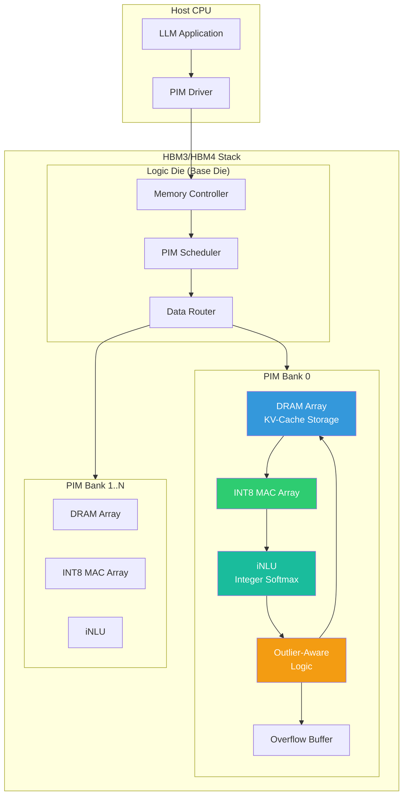
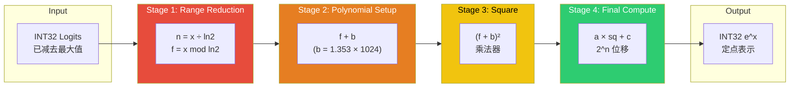
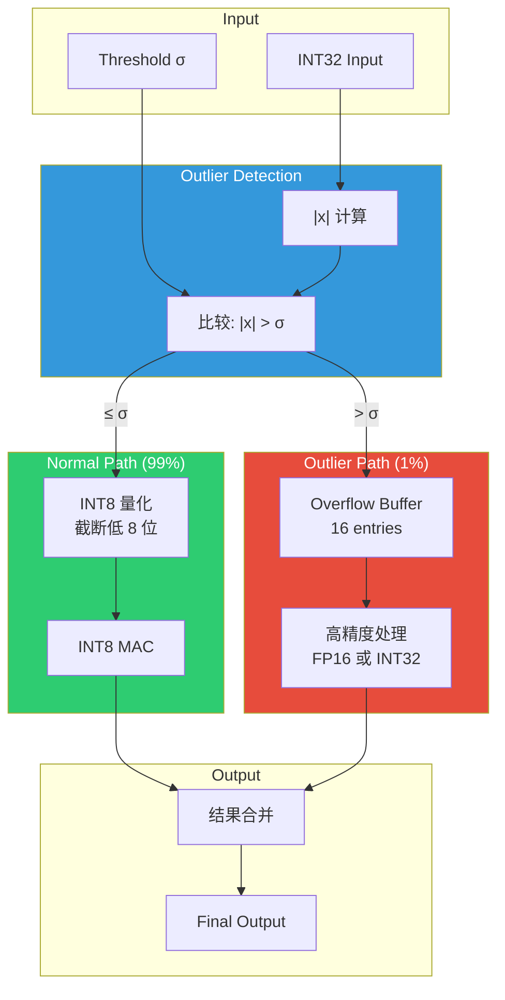
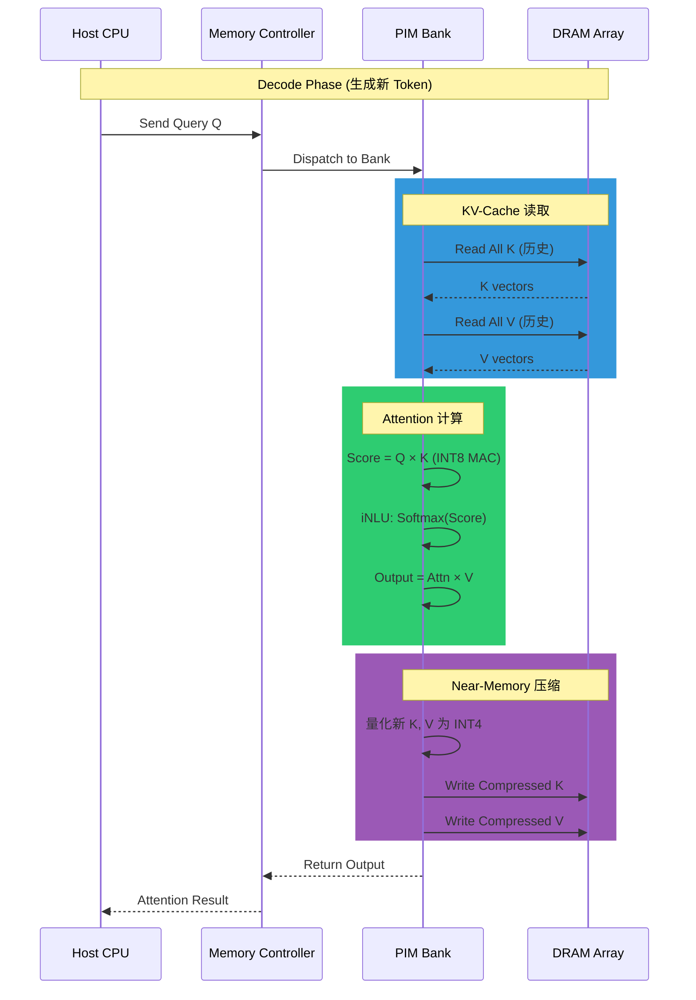
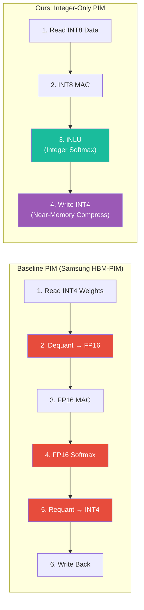

# Integer-Only PIM Architecture Diagrams

This document contains Mermaid diagrams for the paper figures.

## 1. Overall PIM Architecture

## 2. iNLU (Integer Non-Linear Unit) Pipeline

## 3. Outlier-Aware Logic Data Path

## 4. KV-Cache Compression Flow

## 5. Comparison: Baseline vs Ours

---

## Usage in Paper

These diagrams can be:

1. Rendered using Mermaid Live Editor: <https://mermaid.live/>
2. Exported as SVG/PNG for paper inclusion
3. Used directly in Markdown-based paper tools (Overleaf Mermaid plugin, etc.)
