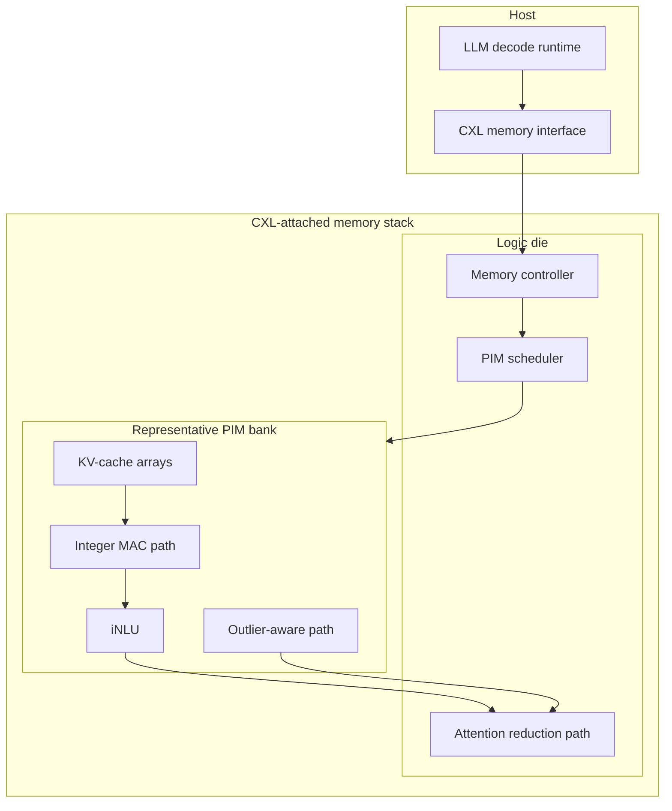
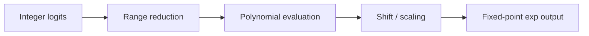
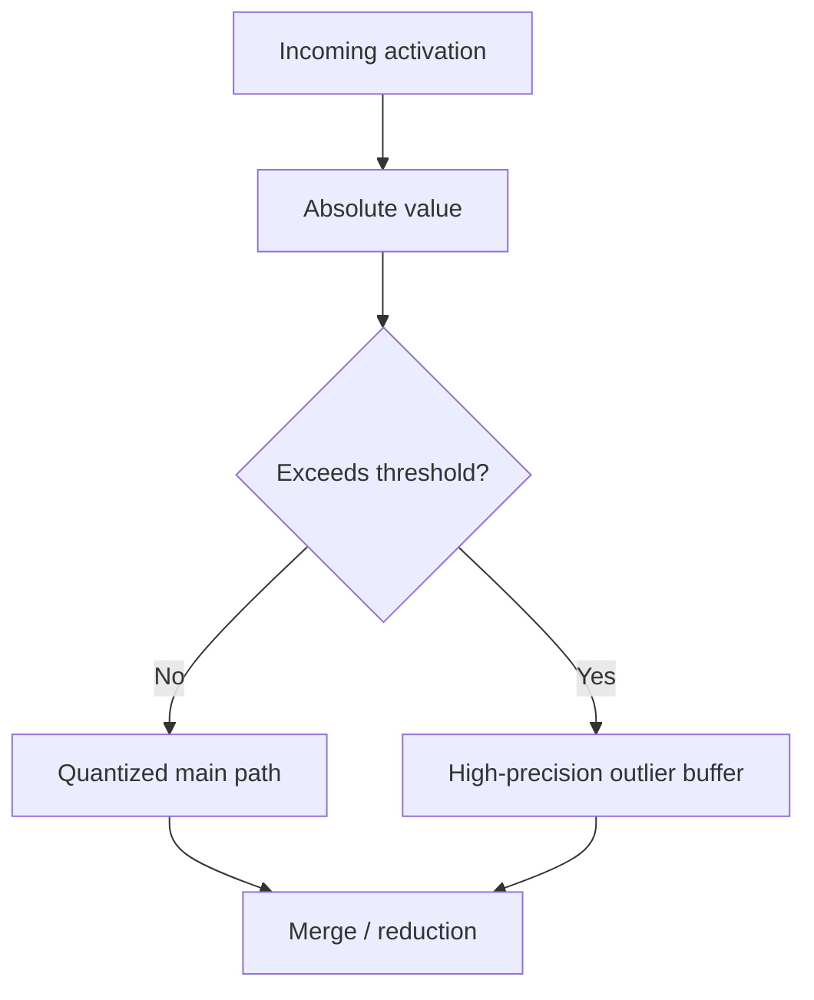
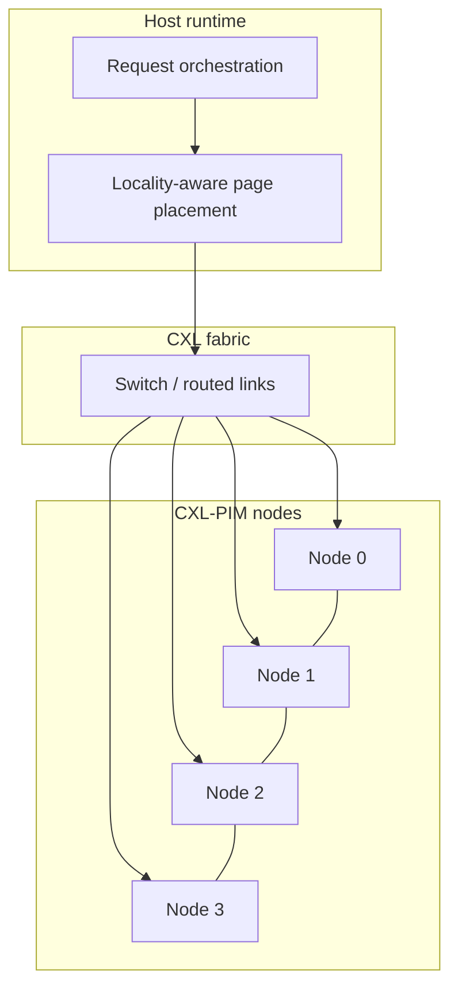

# Architecture Diagram Notes

This document collects conceptual Mermaid diagrams for the main ideas used in the repository. The diagrams are aligned with the current thesis narrative in `thesis/`, but they are intentionally high-level. They should be treated as explanatory sketches, not as cycle-accurate RTL or exact floorplans.

## 1. LKC-CXL-PIM Single-Node Overview

```mermaid
graph TB
    subgraph Host["Host"]
        APP["LLM decode runtime"]
        MEM["CXL memory interface"]
    end

    subgraph Stack["CXL-attached memory stack"]
        subgraph Logic["Logic die"]
            CTRL["Memory controller"]
            SCHED["PIM scheduler"]
            REDUCE["Attention reduction path"]
        end

        subgraph Bank["Representative PIM bank"]
            DRAM["KV-cache arrays"]
            MAC["Integer MAC path"]
            INLU["iNLU"]
            OUT["Outlier-aware path"]
        end
    end

    APP --> MEM --> CTRL --> SCHED --> Bank
    DRAM --> MAC --> INLU --> REDUCE
    OUT --> REDUCE
```

## 2. iNLU Pipeline

```mermaid
graph LR
    X["Integer logits"] --> R["Range reduction"]
    R --> P["Polynomial evaluation"]
    P --> S["Shift / scaling"]
    S --> Y["Fixed-point exp output"]
```

The thesis models the iNLU as a compact fixed-point approximation that replaces a larger floating-point nonlinear block.

## 3. Outlier-Aware Routing

```mermaid
graph TB
    IN["Incoming activation"] --> ABS["Absolute value"]
    ABS --> CMP{"Exceeds threshold?"}
    CMP -->|No| MAIN["Quantized main path"]
    CMP -->|Yes| SIDE["High-precision outlier buffer"]
    MAIN --> MERGE["Merge / reduction"]
    SIDE --> MERGE
```

This path exists to preserve accuracy for rare large activations while keeping the common case in the integer datapath.

## 4. DisaggKV Distributed Overview

```mermaid
graph TB
    subgraph Runtime["Host runtime"]
        SCH["Locality-aware page placement"]
        ORCH["Request orchestration"]
    end

    subgraph Fabric["CXL fabric"]
        SW["Switch / routed links"]
    end

    subgraph Nodes["CXL-PIM nodes"]
        N0["Node 0"]
        N1["Node 1"]
        N2["Node 2"]
        N3["Node 3"]
    end

    ORCH --> SCH
    SCH --> SW
    SW --> N0
    SW --> N1
    SW --> N2
    SW --> N3
    N0 --- N1
    N1 --- N2
    N2 --- N3
```

In the synchronized thesis version, the key system idea is that nodes exchange compact reduction state over the fabric instead of routing full tensor movement back through a host aggregation point.

## 5. Usage Notes

- Prefer the publication figures in `paper_assets/figures/` when you need the final visuals used by the manuscripts.
- Prefer the thesis text in `thesis/` when a diagram and a prose description appear to differ.
- If a diagram here is later promoted into a paper figure, it should be reviewed against the current data and RTL before external use.
